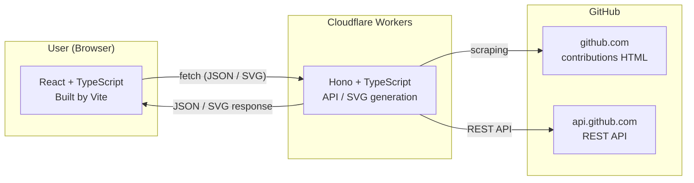

<div align="center">

# Contribution Graph

[](https://github.com/ren510dev/contribution-graph/blob/main/LICENSE)
[](https://github.com/ren510dev/contribution-graph/actions/workflows/deploy.yml)

Visualize any GitHub user's contribution activity as embeddable SVG badges.
**No token required. Just a URL.**

**→ Try it at [contribution-graph.ren510.dev](https://contribution-graph.ren510.dev)**


</div>

---

## Quick Start

Paste this into any GitHub README or website:

```markdown

```

That's it.

---

## Graph Types

| Type            | Preview                                             |
| --------------- | --------------------------------------------------- |
| `calendar`      | GitHub-style contribution heatmap                   |
| `activity-line` | Line chart of daily contributions (last 31 days)    |
| `stats-bar`     | Contribution insights with day-of-week breakdown    |
| `compact-bar`   | Compact weekly bar chart                            |
| `streak`        | Current streak, longest streak, total contributions |
| `heatmap-ring`  | Circular heatmap ring by week                       |
| `languages`     | Top languages by repository                         |
| `profile-card`  | Profile overview with stats and top languages       |

## Themes

|                                                                                              |                                                                                                |                                                                                            |                                                                                                    |
| -------------------------------------------------------------------------------------------- | ---------------------------------------------------------------------------------------------- | ------------------------------------------------------------------------------------------ | -------------------------------------------------------------------------------------------------- |
|  |        |  |  |
| `bordeaux`                                                                                   | `github`                                                                                       | `dracula`                                                                                  | `tokyo-night`                                                                                      |
|          |  |      |            |
| `nord`                                                                                       | `rose-pine`                                                                                    | `ocean`                                                                                    | `sunset`                                                                                           |

> Light variants available: `github-light`, `bordeaux-light`, `dracula-light`, `nord-light`, `ocean-light`

---

## URL Parameters

```
https://contribution-graph.ren510.dev/graph/:username/:type.svg
```

| Parameter  | Required | Description                          |
| ---------- | :------: | ------------------------------------ |
| `username` |    ✅    | GitHub username                      |
| `type`     |    ✅    | Graph type (see above)               |
| `theme`    |          | Theme name (default: `bordeaux`)     |
| `year`     |          | 4-digit year (default: current year) |

---

## Architecture



## Tech Stack

- React 19 + TypeScript
- Hono (Cloudflare Workers)
- Tailwind CSS 4
- Vite

## License

- [MIT License - ren510dev/contribution-graph]

[mit license - ren510dev/contribution-graph]: https://github.com/ren510dev/contribution-graph/blob/main/LICENSE
